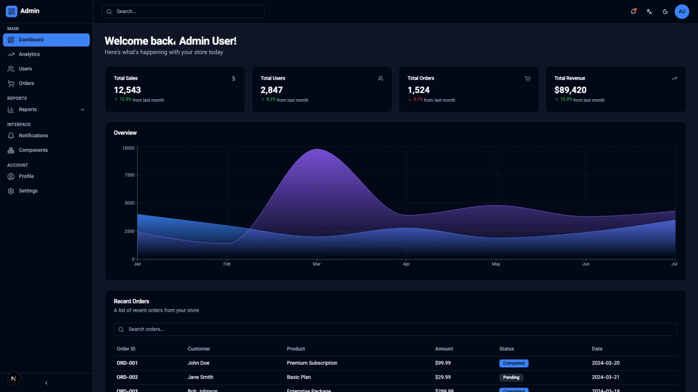

# Modern Admin Dashboard Template

A beautiful, modern admin dashboard built with **Next.js 15**, **TypeScript**, **Tailwind CSS**, and **shadcn/ui**. Features a clean design with dark/light mode support, responsive layout, and comprehensive dashboard components.

> This template is designed and developed under the **Darvix** brand.  
> Website: [`https://darvix.ir/`](https://darvix.ir/)

## 🖼️ Demo Preview



The demo screenshot showcases the main dashboard, analytics, notifications, profile, and components showcase pages.

## 🚀 Features

- ✅ **Next.js 15** with App Router
- ✅ **TypeScript** for type safety
- ✅ **Tailwind CSS** for styling
- ✅ **shadcn/ui** components
- ✅ **Dark/Light mode** with theme toggle
- ✅ **React Query** for data fetching
- ✅ **Responsive design** (mobile-friendly)
- ✅ **Authentication pages** (Login & Register)
- ✅ **Dashboard with analytics**
- ✅ **Users data table** with sorting, filtering, and pagination
- ✅ **Charts** powered by Recharts
- ✅ **Settings page** with form inputs
- ✅ **Built‑in i18n** with Persian (fa) and English (en) translations
- ✅ **RTL/LTR layout support** driven by a `LanguageProvider`
- ✅ **Language toggle** in both auth pages and the main navbar
- ✅ **ESLint & Prettier** configured
- ✅ **Mock data** for development

## 📦 Tech Stack

- **Framework:** Next.js 15
- **Language:** TypeScript
- **Styling:** Tailwind CSS
- **UI Components:** shadcn/ui
- **Icons:** Lucide React
- **Charts:** Recharts
- **Data Fetching:** TanStack Query (React Query)
- **Theme Management:** next-themes
- **Code Quality:** ESLint + Prettier

## 🗂️ Project Structure

```
admin-dashboard-next/
├── src/
│   ├── app/
│   │   ├── (auth)/
│   │   │   ├── login/
│   │   │   │   └── page.tsx
│   │   │   ├── register/
│   │   │   │   └── page.tsx
│   │   │   └── layout.tsx
│   │   ├── (dashboard)/
│   │   │   ├── dashboard/
│   │   │   │   └── page.tsx
│   │   │   ├── users/
│   │   │   │   └── page.tsx
│   │   │   ├── orders/
│   │   │   │   └── page.tsx
│   │   │   ├── reports/
│   │   │   │   └── page.tsx
│   │   │   ├── settings/
│   │   │   │   └── page.tsx
│   │   │   └── layout.tsx
│   │   ├── globals.css
│   │   ├── layout.tsx
│   │   └── page.tsx
│   ├── components/
│   │   ├── ui/
│   │   │   ├── button.tsx
│   │   │   ├── card.tsx
│   │   │   ├── input.tsx
│   │   │   ├── table.tsx
│   │   │   └── ... (more UI components)
│   │   ├── layout/
│   │   │   ├── sidebar.tsx
│   │   │   └── navbar.tsx
│   │   └── dashboard/
│   │       ├── stat-card.tsx
│   │       ├── overview-chart.tsx
│   │       └── recent-orders.tsx
│   ├── lib/
│   │   ├── utils.ts
│   │   ├── api.ts
│   │   └── auth.ts
│   ├── hooks/
│   │   └── use-theme.tsx
│   ├── providers/
│   │   ├── query-provider.tsx
│   │   └── theme-provider.tsx
│   ├── types/
│   │   └── index.ts
│   └── data/
│       ├── mock-users.json
│       ├── mock-orders.json
│       ├── mock-stats.json
│       └── mock-chart.json
├── public/
├── tailwind.config.ts
├── tsconfig.json
├── next.config.ts
├── components.json
├── .prettierrc.json
└── package.json
```

## 🛠️ Installation & Setup

### Prerequisites

- Node.js 18+ and npm/yarn/pnpm

### Clone and Install

```bash
# Navigate to project directory
cd admin-dashboard-next

# Install dependencies
npm install
```

### Run Development Server

```bash
npm run dev
```

Open [http://localhost:3000](http://localhost:3000) in your browser.

## 📱 Pages Overview

### Authentication

- **Login (`/login`)**: User authentication page
- **Register (`/register`)**: New user registration

### Dashboard Pages

- **Dashboard (`/dashboard`)**: Main dashboard with stats, charts, and recent orders
- **Users (`/users`)**: User management with sortable, searchable, filterable data table and pagination
- **Orders (`/orders`)**: Simple orders table with status badges for each order
- **Reports (`/reports`)**: Analytics and detailed reports
- **Settings (`/settings`)**: User preferences and account settings
- **Analytics (`/analytics`)**: Detailed analytics with metrics cards, traffic sources, top pages, and overview/engagement/conversion tabs
- **Notifications (`/notifications`)**: Notification center with unread/read tabs, mark‑all‑as‑read, and inline actions
- **Profile (`/profile`)**: Profile page with avatar, profile form (name, email, phone, location), password change, and recent activity
- **Components Showcase (`/components-demo`)**: Full gallery of all UI components (buttons, badges, inputs, select, switch, alerts, progress, avatar, skeleton, cards, table, tabs, dialog, dropdown, combined example, color palette)

## 🎨 Features Breakdown

### Dashboard Page

- 4 statistic cards (Sales, Users, Orders, Revenue)
- Interactive area chart showing trends
- Recent orders table with search functionality

### Users Page

- Sortable data table
- Search by name or email
- Filter by role and status
- Pagination

### Settings Page

- Profile information form
- Theme selection (Light/Dark/System)
- Notification preferences

## 🎯 Scripts

```bash
# Development
npm run dev

# Build for production
npm run build

# Start production server
npm start

# Lint code
npm run lint

# Format code with Prettier
npm run format

# Check formatting
npm run format:check
```

## 🌈 Theme Support

The dashboard supports three theme modes:

- **Light Mode**
- **Dark Mode**
- **System** (follows OS preference)

Toggle theme using the button in the top navbar.

## 🔐 Authentication

Currently uses **mock authentication** stored in localStorage:

- Any email/password combination will work for login
- After login, you'll be redirected to `/dashboard`
- User data is stored in localStorage

**For production:** Replace mock auth in `src/lib/auth.ts` with real authentication (NextAuth.js, Auth0, etc.).

## 📊 Mock Data

Mock data is located in `src/data/`:

- `mock-users.json`: User data
- `mock-orders.json`: Order data
- `mock-stats.json`: Dashboard statistics
- `mock-chart.json`: Chart data

Replace with real API calls in `src/lib/api.ts` for production.

## 🚀 Deployment

### Vercel (Recommended)

1. Push your code to GitHub
2. Import project in [Vercel](https://vercel.com)
3. Deploy with one click

### Build & Deploy Manually

```bash
npm run build
npm start
```

## 🎨 Customization

### Colors

Edit `src/app/globals.css` to customize the color palette.

### Components

All UI components are in `src/components/ui/` and can be customized.

### Navigation

Edit sidebar navigation in `src/components/layout/sidebar.tsx`.

## 📝 Environment Variables

Create a `.env.local` file for environment variables:

```env
# Add your environment variables here
NEXT_PUBLIC_API_URL=https://your-api.com
```

## 🤝 Contributing

Contributions are welcome! Please feel free to submit a Pull Request.

## 📄 License

This project is open source and available under the MIT License.

## 🙏 Acknowledgments

- [Next.js](https://nextjs.org/)
- [shadcn/ui](https://ui.shadcn.com/)
- [Tailwind CSS](https://tailwindcss.com/)
- [Lucide Icons](https://lucide.dev/)
- [Recharts](https://recharts.org/)

---

**Built with ❤️ using Next.js 15 — by [Darvix](https://darvix.ir/)**  
Darvix: توسعه وب، طراحی UI/UX و محصولات دیجیتال مدرن با تکنولوژی‌های روز.  
وب‌سایت: [`https://darvix.ir/`](https://darvix.ir/)
